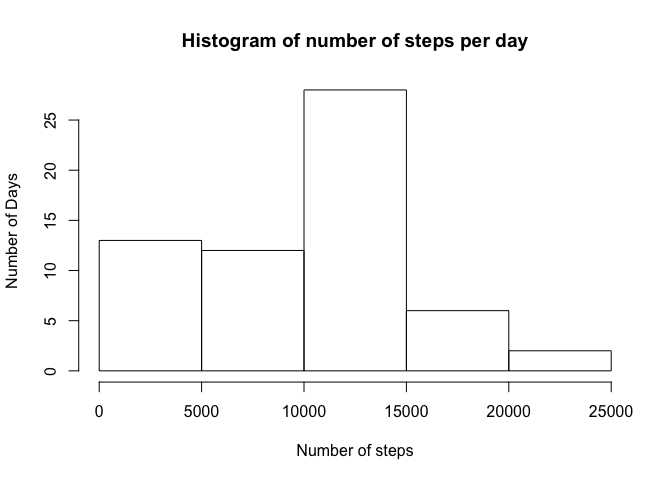
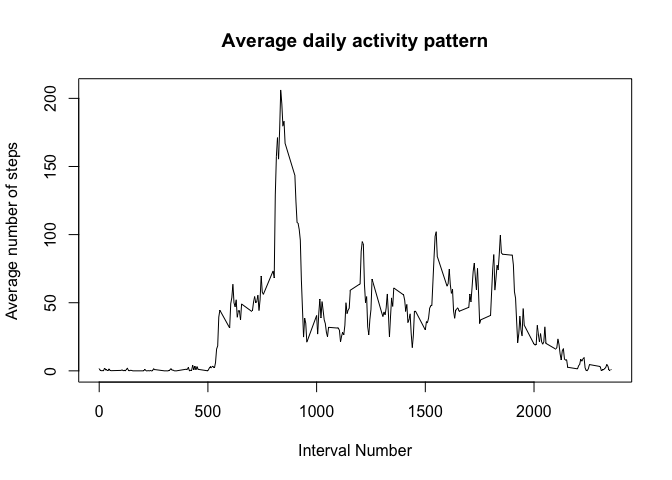
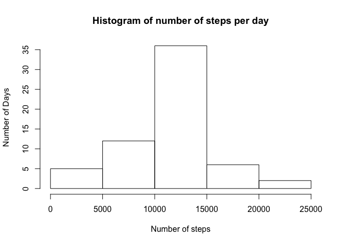
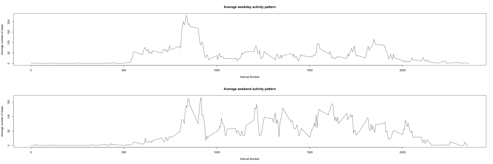

# Reproducible Research: Peer Assessment 1

## Loading and preprocessing the data
First we start with loading the data and making the second column a POSIXlt
date.

```r
walkingData <- read.table("activity.csv", header = TRUE, sep = ",", 
                         colClasses = c("numeric", "character", "numeric"))
date <- walkingData$date
date <- strptime(date, format = "%Y-%m-%d")
walkingData$date <- date
```

## What is mean total number of steps taken per day?
Then we caclulate the number of steps taken per day and present the in a
histogram.

```r
daySplit <- split(walkingData, as.Date(walkingData$date))
n <- NULL
for(dayFrame in daySplit) {
     n <- c(n, sum(dayFrame$steps, na.rm = TRUE))
}
hist(n, main = "Histogram of number of steps per day", xlab = "Number of steps", ylab = "Number of Days")
```

 

The mean number of steps per day, averaged over all the days, and their median
is given by the following code


```r
mean(n)
```

```
## [1] 9354.23
```

```r
median(n)
```

```
## [1] 10395
```

## What is the average daily activity pattern?
The average daily activity pattern is generated by the following code

```r
intervalSplit <- split(walkingData, walkingData$interval)
m <- NULL
for(intervalFrame in intervalSplit) {
     m <- c(m, mean(intervalFrame$steps, na.rm = TRUE))
}
par(mfrow=c(1,1))
plot(levels(as.factor(walkingData$interval)), m, type = "l", 
     main = "Average daily activity pattern", xlab = "Interval Number", 
     ylab = "Average number of steps")
```

 

The maximum number of average steps occur in the following interval


```r
which.max(m)
```

```
## [1] 104
```

## Imputing missing values
The number of missing values is

```r
sum(is.na(walkingData$steps))
```

```
## [1] 2304
```
We impute these missing values with the avarage value of the respective interval

```r
imputedData <- walkingData
naData <- imputedData[is.na(imputedData$steps), ]
intervalList <- levels(as.factor(imputedData$interval))

for (i in 1:nrow(naData)){
     index <- which(intervalList == naData[i, ]$interval)
     naData[i, ]$steps <- m[index]
}

imputedData[is.na(imputedData$steps), ] <- naData
```
The histogram, mean and median values are computed using the following code

```r
daySplit <- split(imputedData, as.Date(imputedData$date))

n <- NULL
for(dayFrame in daySplit) {
     n <- c(n, sum(dayFrame$steps, na.rm = TRUE))
}
hist(n, main = "Histogram of number of steps per day", xlab = "Number of steps", 
     ylab = "Number of Days")
```

 

```r
mean(n)
```

```
## [1] 10766.19
```

```r
median(n)
```

```
## [1] 10766.19
```
We observe that the mean and median values of steps taken per day increase and
become equal. The impact of this particular imputation procedure made the histogram more
symmetric, a change that is reflected in these two values.


## Are there differences in activity patterns between weekdays and weekends?
The requested panel plot is computed by the following code

```r
imputedData$date <- weekdays(imputedData$date)
for (i in 1:nrow(imputedData)){
     if (imputedData$date[i] == "Saturday" || imputedData$date[i] == "Sunday") {
          imputedData$date[i] = "Weekend"
     } else {
          imputedData$date[i] = "Weekday"
     }
}

imputedData$date <- as.factor(imputedData$date)

splitWeek <- split(imputedData, imputedData$date)
weekData <- splitWeek[[1]]
weekendData <- splitWeek[[2]]


intervalSplit <- split(weekData, weekData$interval)

par(mfrow=c(2,1))
m <- NULL
for(intervalFrame in intervalSplit) {
     m <- c(m, mean(intervalFrame$steps))
}
plot(levels(as.factor(weekData$interval)), m, type = "l",
     main = "Average weekday activity pattern", xlab = "Interval Number", 
     ylab = "Average number of steps")


intervalSplit <- split(weekendData, weekendData$interval)

m <- NULL
for(intervalFrame in intervalSplit) {
     m <- c(m, mean(intervalFrame$steps))
}
plot(levels(as.factor(weekendData$interval)), m, type = "l",
     main = "Average weekend activity pattern", xlab = "Interval Number", 
     ylab = "Average number of steps")
```

 
As we can see, there is increased weekend activity in the middle to late
intervals (noon to afternoon).
